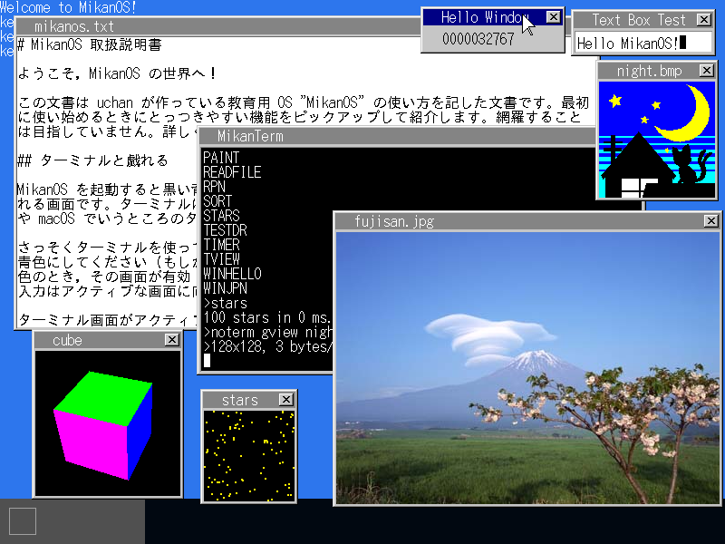

# MikanOS

MikanOS はレガシーフリーなアーキテクチャ（UEFI BIOS、Intel 64 モード）で動作する教育用オペレーティングシステムです。

## ファイル構成

- MikanLoaderPkg
    - UEFI アプリとして構成したブートローダ
- kernel
    - MikanOS のカーネル
- resource/nihongo.ttf
    - IPA ゴシックのフォントファイル
- IPA_Font_License_Agreement_v1.0.txt
    - IPA フォントのライセンス文書

## 教科書

MikanOS の作り方を説明した教科書があります。
[ゼロからのOS自作入門](https://zero.osdev.jp/)

## スクリーンショット

「ゼロからのOS自作入門」の最終章を終えたときの姿

## 開発への参加

MikanOS への機能追加、バグ修正の提案は Pull Request にてお願いします。

実装が伴わない「単なる要望」は基本的に受け付けません。
実装をきちんと作ってから Pull Request を提出してください。

もし、実装したいけど力が不足して実装できない、という場合はお気軽に Issues でご連絡ください。
実装ができるようになるように、できるだけご協力いたします。
